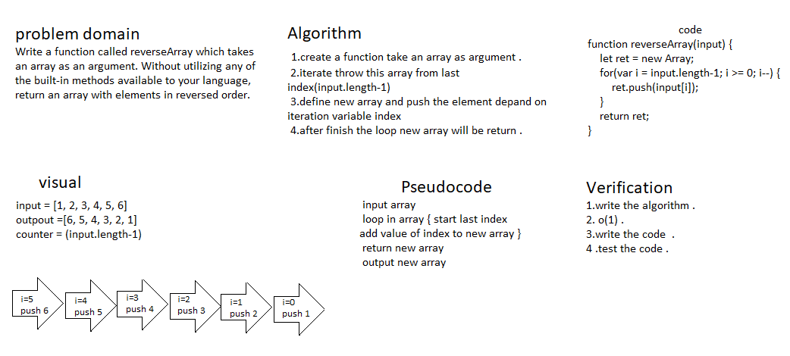

# Reverse an Array
## we should Write a function called reverseArray which takes an array as an argument. Without utilizing any of the built-in methods available ,and  return an array with elements in reversed order.
## Whiteboard Process:

## Approach & Efficiency :
### at the first method I use for loop and start from the last element to first one  and push it to new array then will return the new array .
### and second  method is very similar to the first one and does not modify the original array. Instead of using a for loop, useing forEach() & unshift() methods. forEach() method performs an operation for each element of an array and the unshift method adds a new element to the beginning of an array.