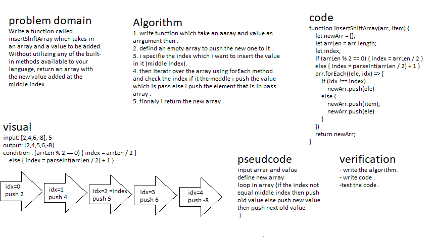

# insertShiftArray
## we should Write a function called insertShiftArray which takes in an array and a value to be added. Without utilizing any of the built-in methods available to your language, return an array with the new value added at the middle index.
## Whiteboard Process:

## Approach & Efficiency :
### to solve this challange i do some steps so 
1. write function which take an aaray and value as arrgument then .
2. defind an empty array to push the new one to it .
3. i specifie the index which i want to insert the value in it (middle index).
4. then iteratr over the array using forEach method and check the index if it the meddle i push the value which is pass else i push the element that is in pass array .
5.finnaly i return the new array. 