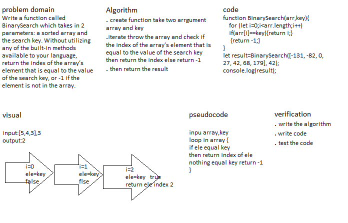

# array-binary-search
## we should Write a function called BinarySearch which takes in 2 parameters: a sorted array and the search key. Without utilizing any of the built-in methods available to your language, return the index of the array’s element that is equal to the value of the search key, or -1 if the element is not in the array.## Whiteboard Process:

## Approach & Efficiency :
### at the first method I use for loop then i check if the element equal the key value (true) will return the index of element and if there is not any element equal the key value return -1.
