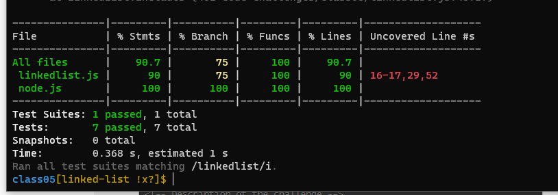
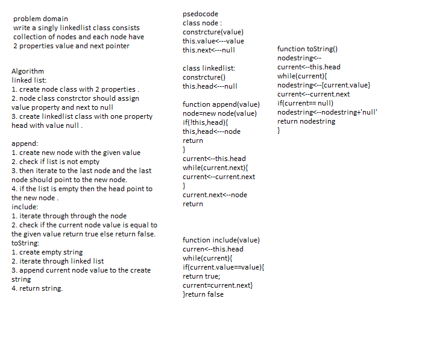

# Singly Linked List
### Singly linked lists contain nodes which have a data field as well as 'next' field, which points to the next node in line of nodes. Operations that can be performed on singly linked lists include insertion, deletion and traversal.

## Challenge
<!-- Description of the challenge -->
### Implementation: Singly Linked Lists
+ create node class
+ Create a Linked List class with the folowing metods 
1. insert
2. includes
3. to string 
+ and test all above methods .

# test result :

## Approach & Efficiency
+ i undertand the problem first
+ I imagined how the results should be
+ I wrote the code
+ I made the tests
