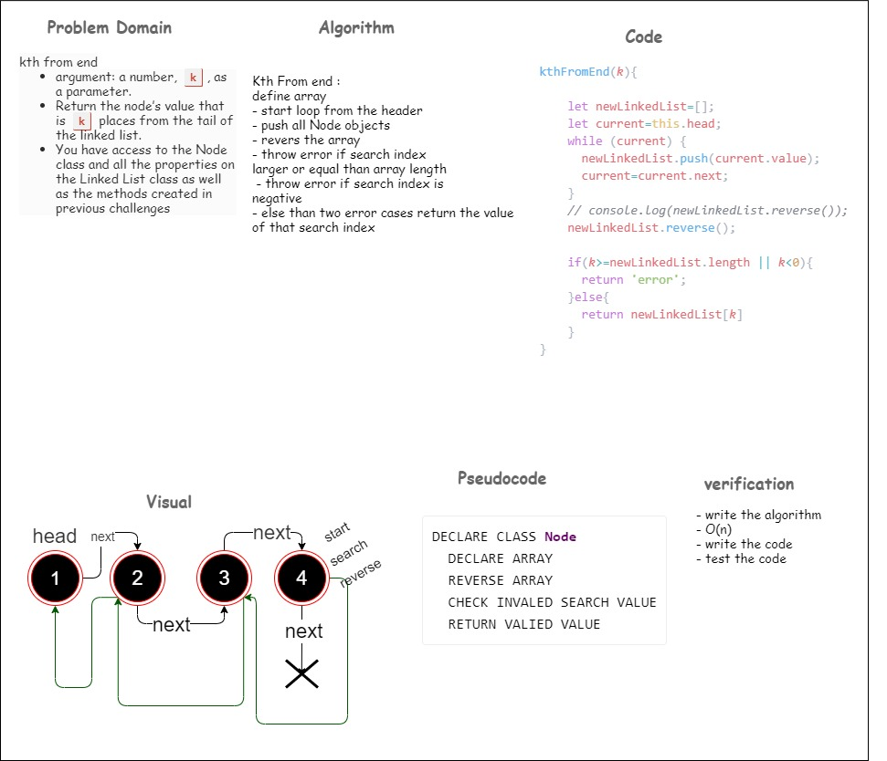
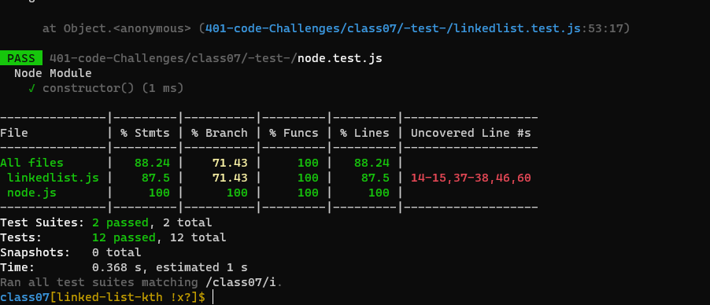

# Challenge Summary
k-th value from the end of a linked list.

## Whiteboard Process
<!-- Embedded whiteboard image -->

## Approach & Efficiency
<!-- What approach did you take? Why? What is the Big O space/time for this approach? -->
+ i undertand the problem first
+ I imagined how the results should be
+ I wrote the code
+ I made the tests

### O(n)

## Solution
<!-- Show how to run your code, and examples of it in action -->
### npm test

### the result
