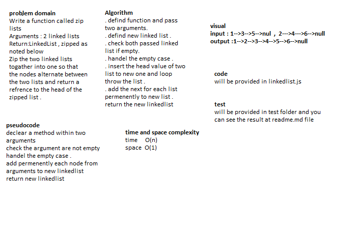
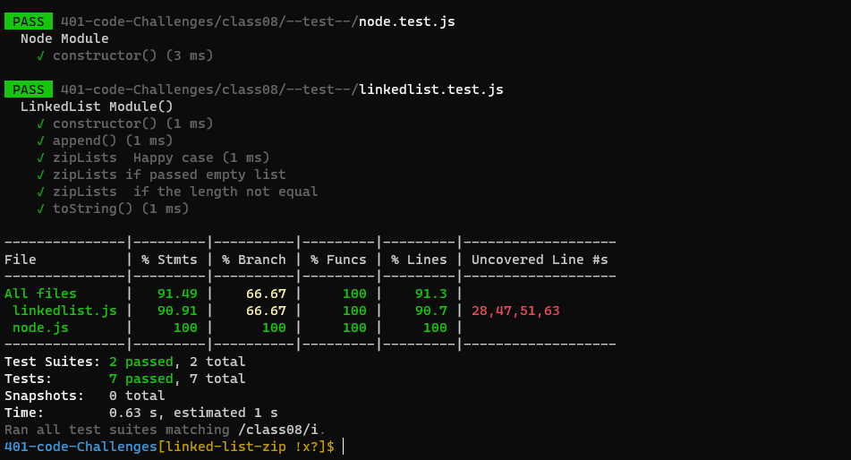

# Challenge Summary
`
Write a function called zip lists
Arguments : 2 linked lists
Return:LinkedList , zipped as noted below
Zip the two linked lists togather into one so that the nodes alternate between the two lists and return a refrence to the head of the zipped list .
`
## Whiteboard Process
<!-- Embedded whiteboard image -->

## Approach & Efficiency
<!-- What approach did you take? Why? What is the Big O space/time for this approach? -->
+ i undertand the problem first
+ I imagined how the results should be
+ I wrote the code
+ I made the tests

### O(n)

## Solution
<!-- Show how to run your code, and examples of it in action -->
### npm test

### the result
