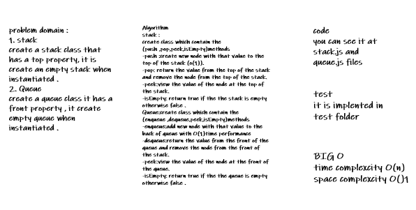
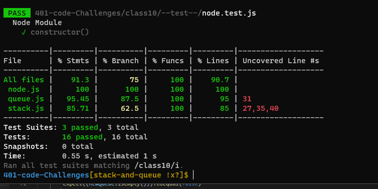

# Stacks and Queues
<!-- Short summary or background information -->
`
Implementation Stacks and Queues using linkedlist 
`
## Challenge
<!-- Description of the challenge -->
``` 
today our challenge is to implement the stack and queue using linkedlist and craete push , pop ,peek and isEmpty methods for stack and enqueue,dequeue , peek and isEmpty methods for Queue .also test our code 
```

## Approach & Efficiency
<!-- What approach did you take? Why? What is the Big O space/time for this approach? -->
+ i undertand the problem first
+ I imagined how the results should be
+ I wrote the code
+ I made the tests

## API
<!-- Description of each method publicly available to your Stack and Queue-->

**Stack**
+ push method : create new node , assign the next property of the new node to reference the same Node that top is referencing , re-assign our reference top to the newly added Node .
+ pop method: first step of removing Node  from the stack is to create a reference named temp that points to the same Node that top points to.then  re-assign top to the value that the next property is referencing.temp.next will be null and finally return the remove item.
+ peek: first thing check if the stack is empty or not if not empty return the top value else throw an error stack is empty.
+ isEmpty : if empty return true otherwise return false.
**Queue**
+ enqueue: create new node if queue is empty then this.front equal new node otherwise loop through the queue until the node value is null then add new node .
+ dequeue: we will remove from the first (fifo) so check if the queue is empty then return messege the queue is empty otherwise remove first node.
+first thing check if the stack is empty or not if not empty return the top value else throw an error stack is empty.
+ isEmpty : if empty return true otherwise return false. 
## Whiteboard Process


## test result 
