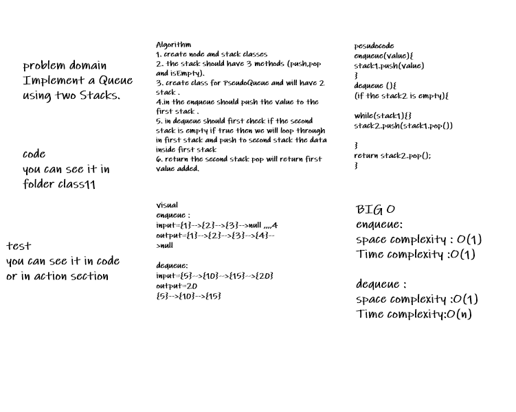
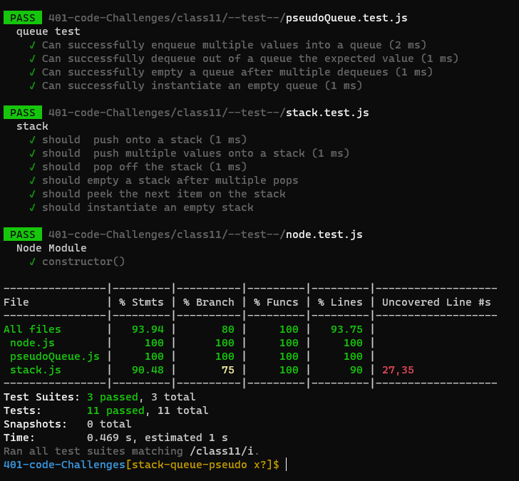

# Stacks and Queues

## Challenge Summary
<!-- Description of the challenge -->
`
Implement a Queue using two Stacks.
`
``` 
today our challenge is to implement a Queue using two Stacks and craete push , pop ,peek and isEmpty methods for stack and enqueue,dequeue  methods for Queue .also test our code 
```
## Whiteboard Process



## Approach & Efficiency
<!-- What approach did you take? Why? What is the Big O space/time for this approach? -->
- write the implemntation
- write the test
- write the whitebord
- write the test and testing

1. Stack

- push 
#### Arguments: value adds a new node with that value to the top of the stack with an O(1) Time performance.

- pop

#### Arguments: none Returns: the value from node from the top of the stack Removes the node from the top of the stack Should raise exception when called on empty stack

- peek

#### Arguments: none Returns: Value of the node located at the top of the stack Should raise exception when called on empty stack is empty

#### Arguments: none Returns: Boolean indicating whether or not the stack is empty.

2. Queue

- Create a new class called pseudo queue
- Internally, utilize 2 Stack instances to create and manage the queue


- dequeue and enqueue methods 


## Solution
***npm test* 

## test result 
