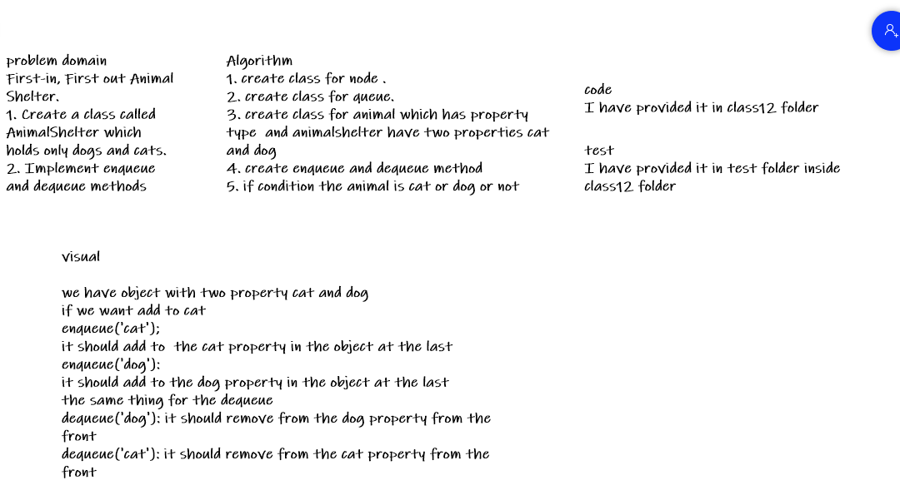
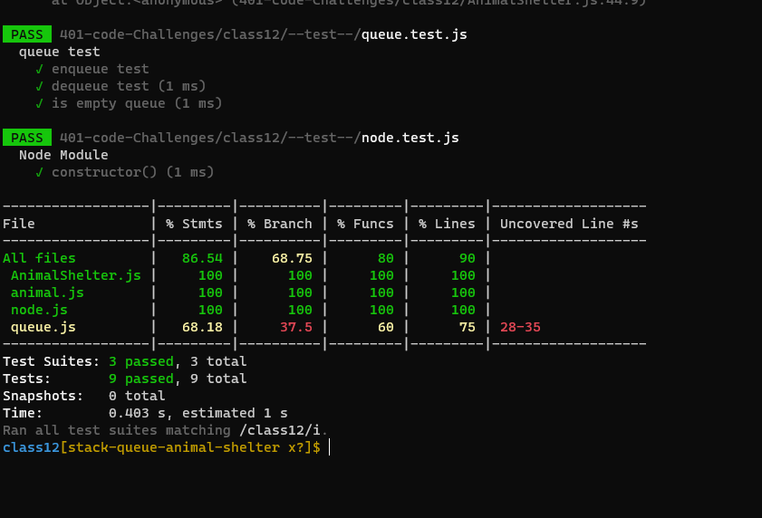

# Challenge Summary
<!-- Description of the challenge -->
### Implement the following methods: enqueue(animal): adds animal to the shelter. animal can be either a dog or a cat object. dequeue(pref): returns either a dog or a cat. If pref is not "dog" or "cat" then return null.
## Whiteboard Process
<!-- Embedded whiteboard image -->

## Approach & Efficiency
<!-- What approach did you take? Why? What is the Big O space/time for this approach? -->
+ i undertand the problem first
+ I imagined how the results should be
+ I wrote the code: create class animal and class animel shelter , write the enqueue and dequeue method 
+ I made the tests and check it 

+ enqueue:
Time: O(1)
Space: O(1)
+ dequeue:
Time: O(n)
Space: O(n)

## Solution
<!-- Show how to run your code, and examples of it in action -->
+ test my code using npm test
