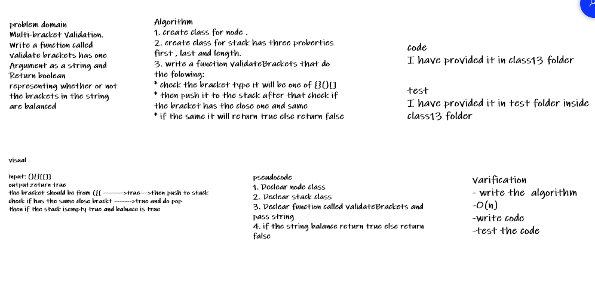
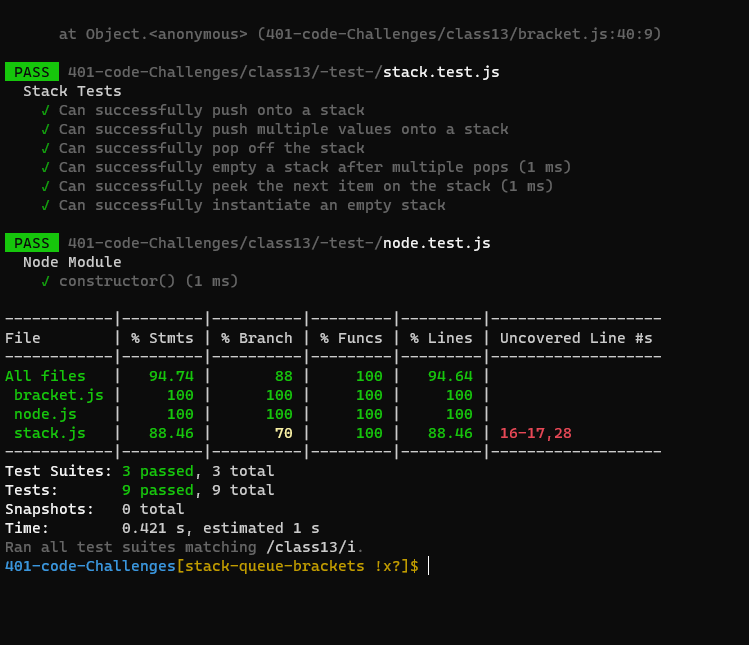

# Challenge Summary
<!-- Description of the challenge -->
## Multi-bracket Validation , we should Write a function called validate brackets has one argument as string and it will return boolean representing whether or not the brackets in the string are balanced

### There are 3 types of brackets:

- Round Brackets : ()
- Square Brackets : []
- Curly Brackets : {}

## Whiteboard Process
<!-- Embedded whiteboard image -->

## Approach & Efficiency
<!-- What approach did you take? Why? What is the Big O space/time for this approach? -->
+ I undertand the problem first
+ I imagined how the results should be
+ I wrote the code: create class node and class stack , write the validateBrackets function which take one arrgument as string
+ I made the tests and check it 

+ O(n)

## Solution
<!-- Show how to run your code, and examples of it in action -->
+ test my code using npm test
