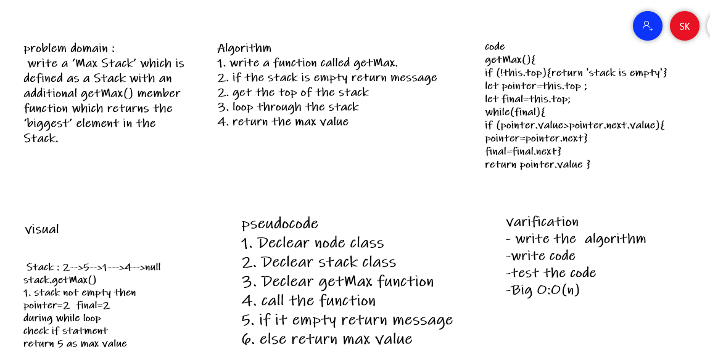
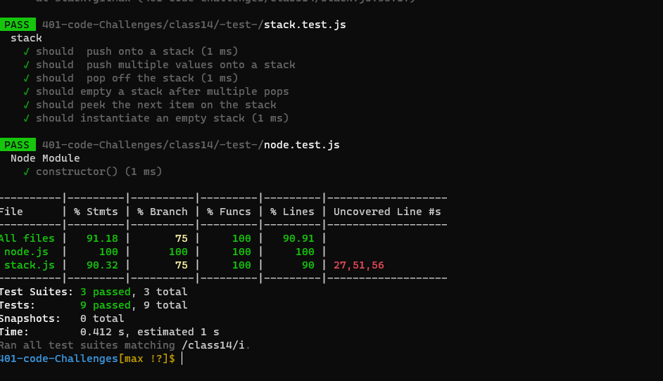

# Challenge Summary
### write a ‘Max Stack’ which is defined as a Stack with an additional getMax() member function which returns the ‘biggest’ element in the Stack.

## Approach & Efficiency
<!-- What approach did you take? Why? What is the Big O space/time for this approach? -->
+ I undertand the problem first
+ I imagined how the results should be
+ I wrote the code: create class node and class stack , write the validateBrackets function which take one arrgument as string
+ I made the tests and check it 

+ O(n)

## Whiteboard Process
<!-- Embedded whiteboard image -->

## result test

