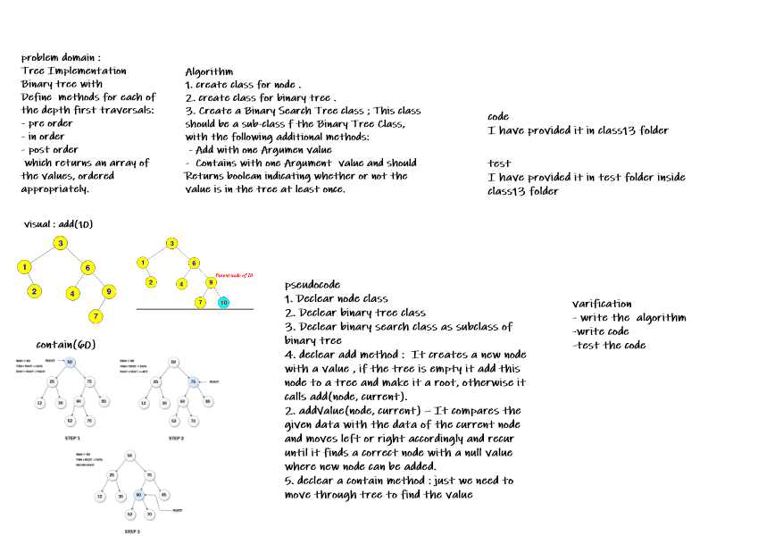
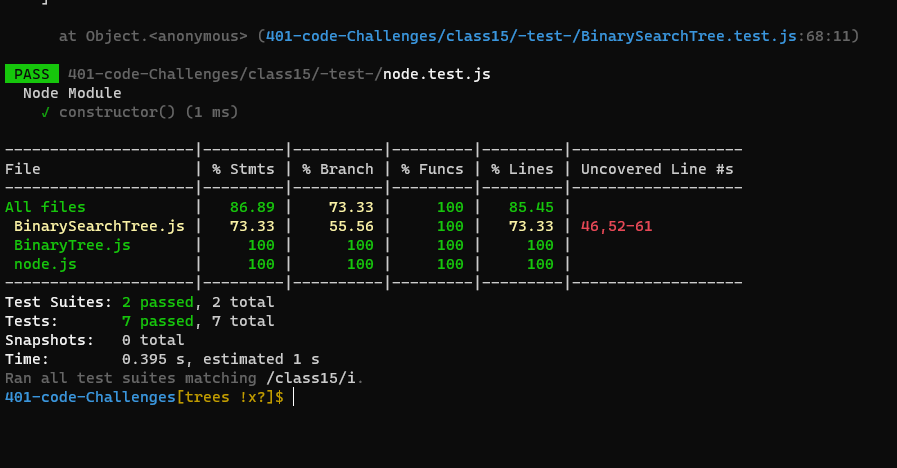

# Trees
<!-- Short summary or background information -->
### using tree non-linier algorithim we can sort the nood using three approuch , preorder , inorder , postordar , to make the node easy to search and move on any node we need.

## Approach & Efficiency
<!-- What approach did you take? Why? What is the Big O space/time for this approach? -->
+ I undertand the problem first
+ I imagined how the results should be
+ I wrote the code: create class node and class stack , write the validateBrackets function which take one arrgument as string
+ I made the tests and check it 

+ O(n)
## Whiteboard Process
<!-- Embedded whiteboard image -->

## API
<!-- Description of each method publicly available in each of your trees -->
#### add(value) method :  we have two methods add(value) and addValue(node, current). Let’s understand them one by one:- 

1. add(value) – It creates a new node with a value , if the tree is empty it add this node to a tree and make it a root, otherwise it calls add(node, current).
2. addValue(node, current) – It compares the given data with the data of the current node and moves left or right accordingly and recur until it finds a correct node with a null value where new node can be added.
#### contain(value)method :Finding something is incredibly simple, just move left or right relative to the current value and return true if we hit something that matches.

## Solution
<!-- Show how to run your code, and examples of it in action -->
+ test my code using npm test
