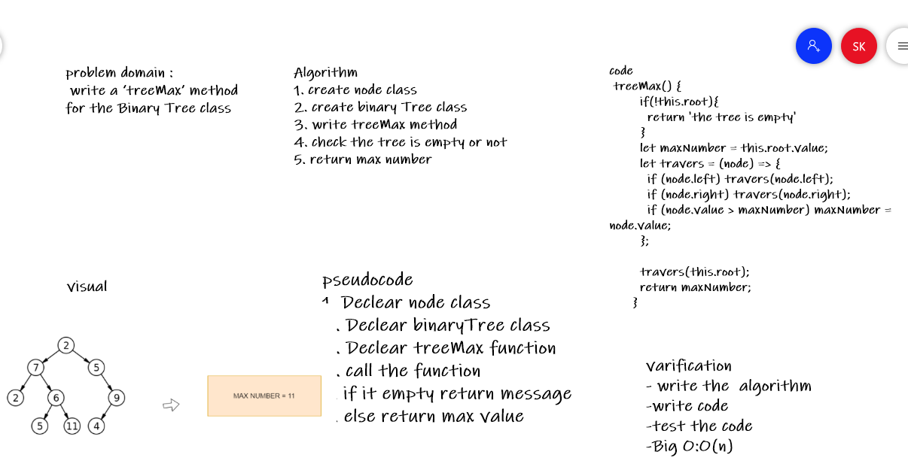
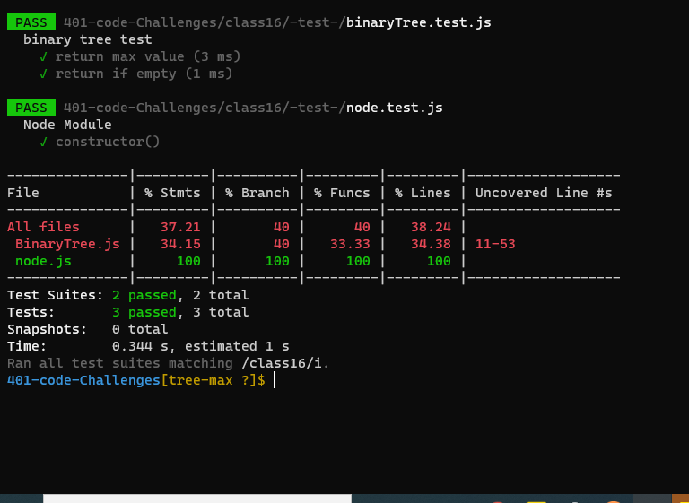

# Trees
<!-- Short summary or background information -->
### Find the Maximum Value in a Binary Tree

## Approach & Efficiency
<!-- What approach did you take? Why? What is the Big O space/time for this approach? -->
+ I undertand the problem first
+ I imagined how the results should be
+ I wrote the code: create class node and class binaryTree , write the treeMax function which 
+ I made the tests and check it 

+ O(n)
## Whiteboard Process
<!-- Embedded whiteboard image -->

## API
<!-- Description of each method publicly available in each of your trees -->
#### treeMax method :  create function to return max value at binary tree 
1. check if the tree is empty return message the tree is empty 
2. declear maxValue variable and the root value to it.
3. traverser to check where is the max value and asign it to the variable to will return finally .

## Solution
<!-- Show how to run your code, and examples of it in action -->
+ test my code using npm test
