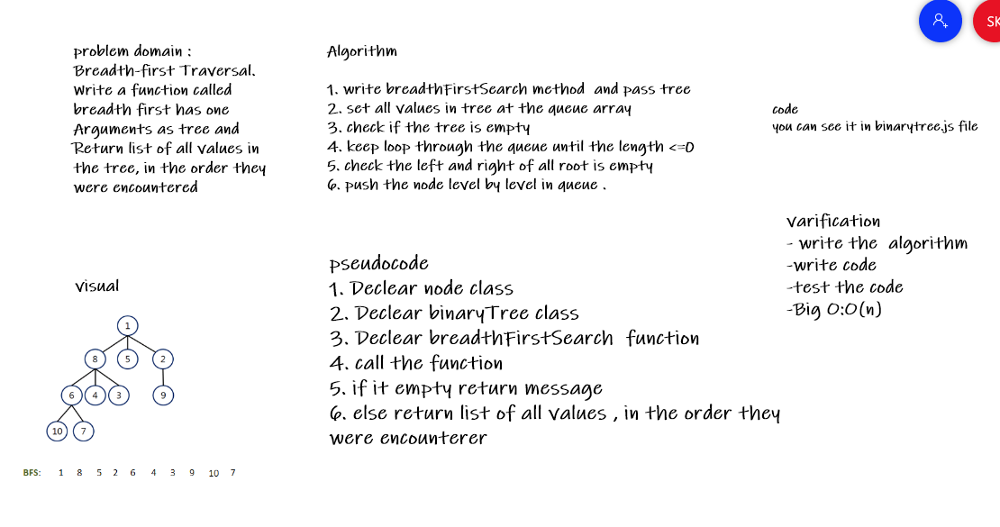
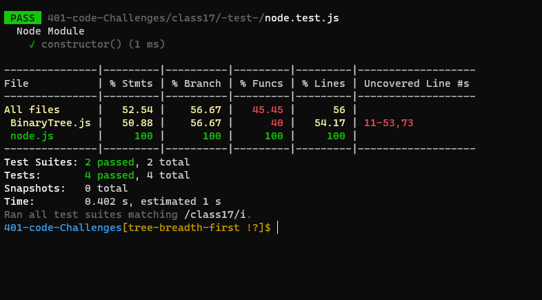

# Trees
<!-- Short summary or background information -->
### Breadth-first Traversal.

## Approach & Efficiency
<!-- What approach did you take? Why? What is the Big O space/time for this approach? -->
+ I undertand the problem first
+ I imagined how the results should be
+ I wrote the code: create class node and class binaryTree , write the breadthFirstSearch function which have a tree as Argument and
Return list of all values in the tree, in the order they were encountered
+ I made the tests and check it 

+ O(n)
## Whiteboard Process
<!-- Embedded whiteboard image -->

## API
<!-- Description of each method publicly available in each of your trees -->
####breadthFirstSearch :  create function to return list of all values in the tree, in the order they were encountered
1. write breadthFirstSearch method  and pass tree
2. set all values in tree at the queue array 
3. check if the tree is empty 
4. keep loop through the queue until the length <=0
5. check the left and right of all root is empty
6. push the node level by level in queue .

## Solution
<!-- Show how to run your code, and examples of it in action -->
+ test my code using npm test
