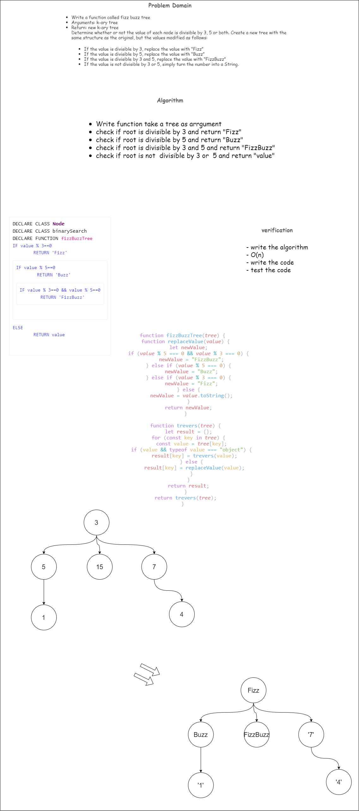
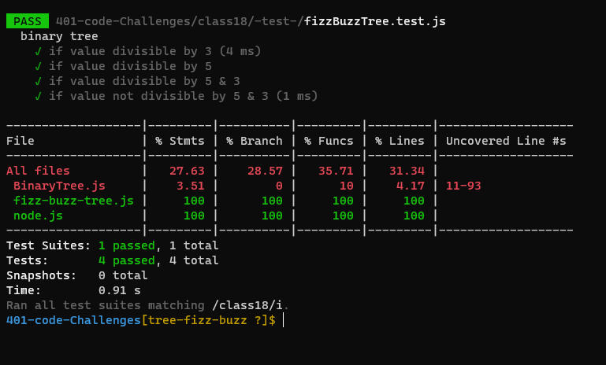

# Trees
<!-- Short summary or background information -->
### Conduct “FizzBuzz” on a k-ary tree while traversing through it to create a new tree.Set the values of each of the new nodes depending on the corresponding node value in the source tree.

## Approach & Efficiency
<!-- What approach did you take? Why? What is the Big O space/time for this approach? -->
+ I undertand the problem first
+ I imagined how the results should be
+ I wrote the code: create class node and class binaryTree , write the fizzBuzzTree function which have a  k-ary tree as Argument and
Return new k-ary tree
+ I made the tests and check it 

+ O(n)
## Whiteboard Process
<!-- Embedded whiteboard image -->

## API
<!-- Description of each method publicly available in each of your trees -->
####breadthFirstSearch :  create function to return  new k-ary tree
1. write breadthFirstSearch method  and pass tree
2. set all values in tree at the queue array 
3. If the value is divisible by 3, replace the value with “Fizz”
4. If the value is divisible by 5, replace the value with “Buzz”
5. If the value is divisible by 3 and 5, replace the value with “FizzBuzz”
6. If the value is not divisible by 3 or 5, simply turn the number into a String.
## Solution
<!-- Show how to run your code, and examples of it in action -->
+ test my code using npm test
