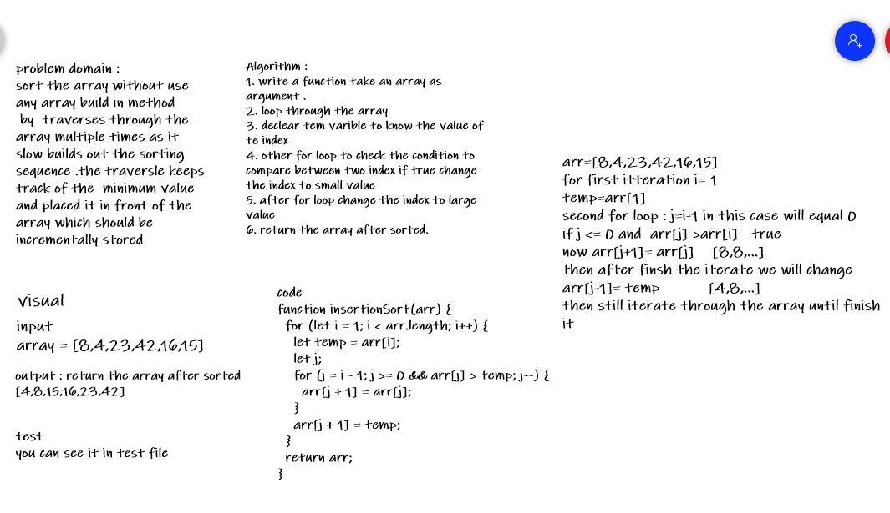
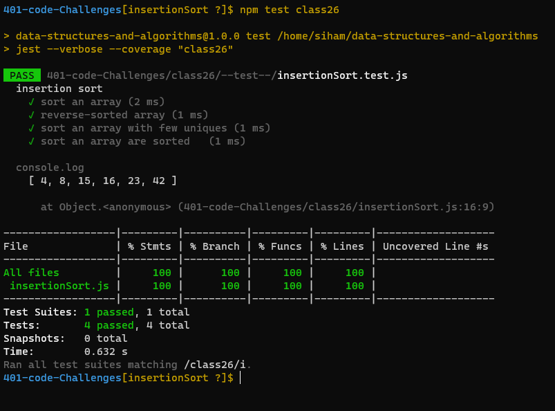

## Challenge Summary
#### sort the array without using any build in method 
## Whiteboard Process

## Approach & Efficiency
1. read the problem carefuly .
2. understand it and try to solve it .
3. by  traverses through the array multiple times as it slow builds out the sorting sequence .the traversle keeps track of the  minimum value and placed it in front of the array which should be incrementally stored 
4. write the code and test it 

## Solution
#### using nested loop to solve the problem and  traverses through the array multiple times as it slow builds out the sorting sequence .the traversle keeps track of the  minimum value and placed it in front of the array which should be incrementally stored 

