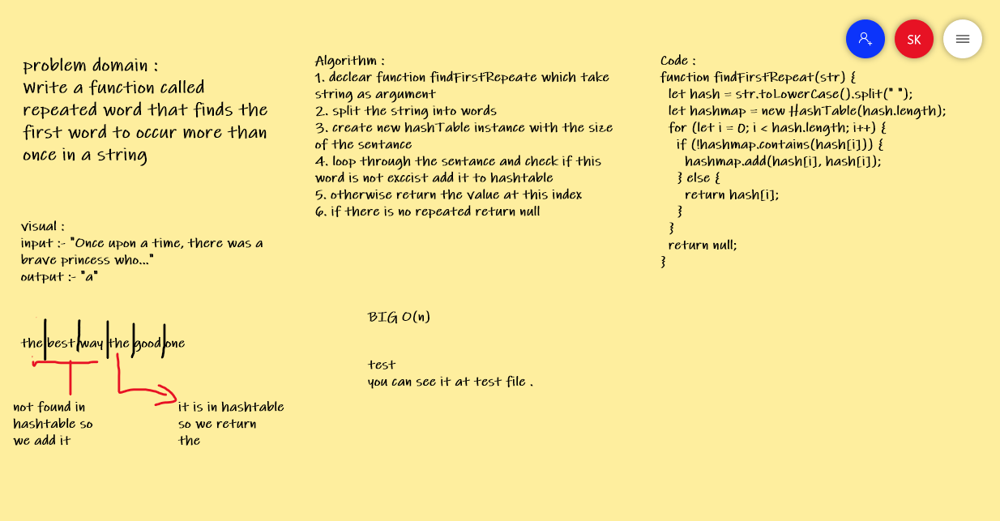
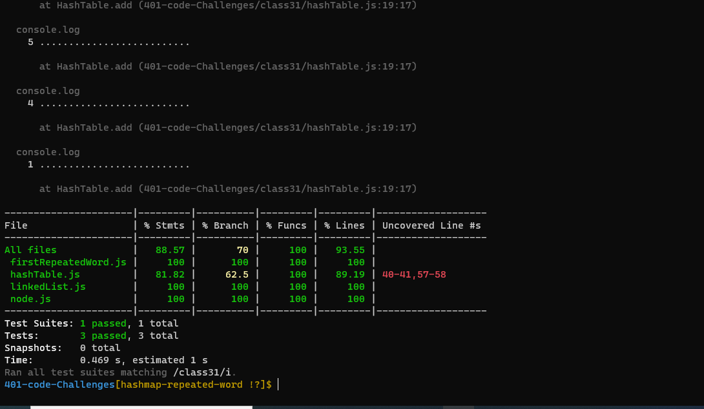

# Challenge Summary
<!-- Description of the challenge -->
 find first repeated word within the string and return it .

## Whiteboard Process
<!-- Embedded whiteboard image -->

## Approach & Efficiency
<!-- What approach did you take? Why? What is the Big O space/time for this approach? -->

+ I undertand the problem first
+ I imagined how the results should be
+ I wrote the code: create class node , class linkedlist and class hash table , write findFirstRepeat function.
+ I made the tests and check it .

## Solution
<!-- Show how to run your code, and examples of it in action -->

